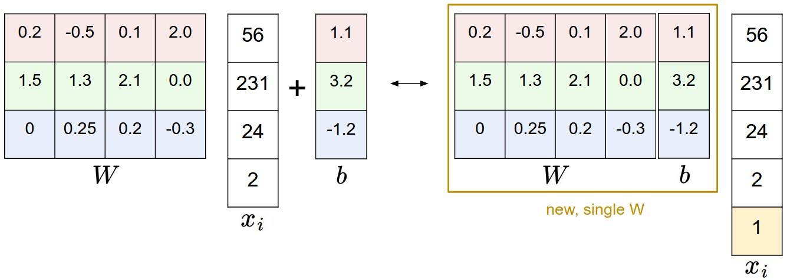

# 提纲
* 线性分类介绍
* 线性score函数
* 理解线性分类器
* 损失函数
	* 多类SVM
	* Softmax分类器
	* SVM vs Softmax
* 总结

# 线性分类
上一节介绍了图片分类问题，即给定一张图片，判断图片的类别label（类别label数量有限）,然后介绍了**K-最近邻**分类器（将给定图片与训练集中的图片比较，找到与给定图片最接近的k张图片，这k张图片的label加权即为给定图片的label），**K-最近邻**分类器有几个缺点：

* 必须存储所有的训练数据，耗费存储空间。
* 测试数据必须与所有的训练数据比较，预测时非常耗时。

我们将发展出一套更强大的图片分类方法，通过这个方法我们可以很自然的引入**神经网络和卷积神经网络**。这个方法由两部分组成：score function和loss function，score function将原始数据映射为其属于某一类的分数，loss function定量的刻画所预测的分数与ground truth labels之间的一致性。最后我们会得到一个优化问题：找到一组描述score function的参数,最小化loss function。

score function定义：假设$x_i \in R^D$为训练集中的图片，对应的label为$y_i$，其中$i = 1 \dots N$ and $y_i \in { 1 \dots K }$,也就是我们有N个训练样本，每个样本的维度为D,这些样本分别属于K个类别。CIFAR-10:N=50000,D=32x32x3=3072个像素,K=10。定义score函数$f: R^D \mapsto R^K$为：$$f(x_i, W, b) =  W x_i + b$$其中：$x_i$已经摊平为1列shape=[Dx1]，矩阵W（[KxD]）和矢量b([Kx1])为参数。对于CIFAR-10数据集：$x_i$([3072x1])中包含第i张图片的所有像素值，W:[10x3072],b:[10x1]，函数的输入为3072个像素值，输出为10个值，可以将这10个数理解为10个类别的评分。W和b分别称为weights和bias。注意几点：
* $W x_i$并行计算10个不同类别的分数，W的一行对应一个类别。
* 我们希望找到一组W和b，使得在整个训练集上，对每一个$x_i$所计算的类别分数中，正确类别所得分数最高。
* 我们通过训练集学到参数W和b以后，可以丢弃训练集只存储参数，当需要预测某张图片的类别时，利用上面的分数函数即可对图片的类别作出预测。
* 与kNN分类器相比，虽然训练过程时间较长，但只要学习到参数，预测很快，而且训练完成后不再需要存储训练集。
> 卷积神经网络CNN也是这样一个将图片像素值映射到类别分数的函数，只不过这个函数要复杂得多。

# 理解线性分类器
注意线性分类器计算类分数的方式：三个颜色通道的所有像素值的加权和。取决于权重的具体数值，线性分类器可以对图片中不同位置的某种颜色表现出一定的偏好（如果偏向某种颜色，则该颜色对应的权重会偏大）。比方说，如果图像的周围被大量的蓝色包围（对应水），那么有很大的可能性认为图像是船。那么这个区分船的线性分类器在蓝色通道上具有更大的权重，在红、绿色通道上具有较小的权重。


上图是将图片映射到类分数的例子，为了方便可视化，假定图像只包含4个像素一个颜色通道，图像仅有三个类别。将图像像素值摊平为一列然后与权重矩阵做乘法运算，再加上bais项就得到权重分数。这里的权重参数矩阵W并没有选好，因为图片输入为猫，所计算出的猫类的分数却不是最高的。

## 将图像理解为高维空间中的点
由于将图像的像素值摊平为一个列向量，我们可以将图像理解为高维空间中的点。比如：CIFAR-10数据集中每张图片都为32x32x3的图像，摊平为列向量后为3072维向量，因此可以将这些图像理解为分布在3072维空间中的点集。想象一下如果我们可以可视化3072维空间，比如用二维空间去”表示“，那么分类器实际上用一条线将某一个类别同其他的类别区分开。


上面为图片空间的卡通描述，每一张图片表示一个点，可视化了3个类别。红线表示car classifier,红线箭头所指方向为car类别得正分的区域，距离红线越远分数越高。相反方向为得负分的区域，距离红线越远，分值越低。

从上面可以看出，W的一行对应一个类别的分类器。从几何的角度来看，当改变权重时，在像素空间中的”线“（超平面）的方向将发生变化，bais参数b表示在该空间中的”线“的平移。如果没有bais项，所有的线都将通过原点。

## 将线性分类器理解为template matching
可以将W的一行理解为一个类的template。将图片依次与这些template做比较（点积）即可得到一张图片每个类的分数，从而判断出图片所属的类别。这有点类似最近邻分类器，最近邻分类器是将待预测的图片与训练集中的所有图片做比较，找到与带比较图片最接近的图片，即可判断待预测图片所属类别。但是这里，待预测图片仅仅与一张图片作比较，这张图片由权重表示，是从训练集学习到的。


上图为学习到的templates，注意到horse template似乎有两个头，这是因为训练集中的马，头的方向有左有右，线性分类器将这两种模式集成到一张template中去。同样的，car classifier似乎将多种模式集成到一个template中去，这个模板必须分辨不同方向不同颜色的车，这个模板最终是红色的车，表示训练集中红色车偏多，模板认为红颜色是车的可能性较大。线性分类器还是太弱，不能区分不同颜色的车。神经网络的隐藏层的神经元能够识别不同颜色，不同侧边，下一层神经元能够将这些组合起来，识别出具体的车型。

将W与b集成到一个矩阵后，score function$f(x_i, W, b) =  W x_i + b$可以改写为$f(x_i, W) =  W x_i$这样的改写使得公式更加紧凑。改写方法如下图：



# 图像数据的处理
像素值得取值范围为[0...255]，在机器学习中，经常要对输入特征进行normalization（对于图片来说，每一个像素值就是一个特征）。将数据的每一个特征减掉整个数据集该特征的平均值从而center the data，对于图像来说，这一步操作后像素值取值范围为[-127,127]。然后scale input feature，使得像素取值范围变为[-1,1]。以上两步骤中，dynamics of gradient descent要将特征**零均值**化，这是非常重要的.

# Loss function
前面定义的score function以W为参数，对一个固定的训练样本$(x_i,y_i)$，我们希望控制权重参数W，使得预测的类分数与其ground truth labels相一致。我们将定义一个量来衡量预测的类分数与其ground truth的不一致性，不一致性约小，那么预测的类分数与其ground truth label就越一致。

## 多类SVM loss
使用多类SVM loss，我们希望图片的正确类分数比不正确类分数还要高$\Delta$。$f(x_i, W)$是由类分数构成的矢量，简写为$s$则第$s$的第j个元素即为第j类的分数，表示为$s_j = f(x_i, W)_j$。第i个训练样本的Multiclass SVM loss可表示为：$$L_i = \sum_{j\neq y_i} \max(0, s_j - s_{y_i} + \Delta)$$举个例子，对于某一个训练样本$x_i$，假设得到的分数为$s = [13, -7, 11]$,$y_i = 0$为真正的类别，$\Delta=10$则该样本的多类SVM loss为：$$L_i = \max(0, -7 - 13 + 10) + \max(0, 11 - 13 + 10)$$可以看到第一项为0，第二项为8，所以这个样本的多类SVM loss为8.总而言之，多类SVM loss希望真实类的分数比不正确类的分数至少高$\Delta$,记住$f(x_i; W) =  W x_i$，其中W的第j行为$w_j^T$，所以多类SVM loss可以写为：$$L_i = \sum_{j\neq y_i} \max(0, w_j^T x_i - w_{y_i}^T x_i + \Delta)$$

## Regularization
regularization penalty$R(W) = \sum_k\sum_l W_{k,l}^2$，完整的多类SVM loss包括两个部分：data loss和regularization loss。$$L =  \underbrace{ \frac{1}{N} \sum_i L_i }_\text{data loss} + \underbrace{ \lambda R(W) }_\text{regularization loss}$$

可以展开为：$$L = \frac{1}{N} \sum_i \sum_{j\neq y_i} \left[ \max(0, f(x_i; W)_j - f(x_i; W)_{y_i} + \Delta) \right] + \lambda \sum_k\sum_l W_{k,l}^2$$

加入正则化项的意义：第一，因为缩放W会使loss变得任意大，所以要对W施加一限制,一种方法就是将W加入loss中，使得data loss小的同时，参数W也小。第二，降低个别特征的重要性，使得大部分特征都或多或少的起着作用。由于正则化项的存在，永远不可能使loss降为0.

以下为loss function的python实现，包括矢量化和半矢量化两种版本：

```python
import numpy as np

def L_i(x, y, W):
"""
没有矢量化的版本。
"""
	delta = 1.0
	scores = W.dot(x)
	correct_class_score = scores[y]
	D = W.shape[0]
	loss_i = 0.0
	for j in range(D):
		if j == y:
		continue
		loss_i += np.max(0, scores[j])
	return loss_i
def L_i_vectorized(x, y, W):
	"""
	half-vectorized
	"""
	#code here
	return loss_i
def L(X, y, W):
	"""
	fully-vectorized implementation
	"""
	#code here

```
[本节参考](http://cs231n.github.io/)

<span id="busuanzi_container_page_pv">
  本文总阅读量<span id="busuanzi_value_page_pv"></span>次
</span>